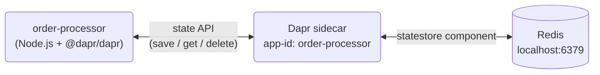

# Dapr state management quickstart (JavaScript SDK)

A single-service quickstart that demonstrates the [Dapr state management API](https://docs.dapr.io/developing-applications/building-blocks/state-management/) with the JavaScript SDK. The `order-processor` service loops 100 times and, on each iteration, saves an order to a state store, reads it back, and deletes it.

State is persisted in Redis through a Dapr [state store component](./resources/statestore.yaml), so the application code never talks to Redis directly — it only calls `client.state.save()`, `client.state.get()`, and `client.state.delete()`.

## Architecture



| Piece | Role |
| --- | --- |
| `order-processor` | Node.js app that calls the Dapr state API via the SDK |
| Dapr sidecar | Started by `dapr run`; resolves the `statestore` name to a concrete component |
| `resources/statestore.yaml` | Component definition binding the name `statestore` to Redis |
| `resources/resiliency.yaml` | Retry + circuit breaker policy applied to outbound `statestore` calls |
| Redis | The state store itself, running locally in Docker |

## Prerequisites

- [Node.js](https://nodejs.org/) 18 or later
- [Dapr CLI](https://docs.dapr.io/getting-started/install-dapr-cli/), initialized with `dapr init`
- [Docker Desktop](https://docs.docker.com/desktop/), running (Redis runs in a container)

## Start a local Redis

The state store component points at `localhost:6379`. Make sure Docker Desktop is running,
then pick whichever option fits your setup.

### Option 1: Reuse the Redis that `dapr init` created (simplest)

`dapr init` already starts a Redis container named `dapr_redis` on port 6379. Check that it is running:

```bash
docker ps --filter name=dapr_redis
```

If it appears in the output, you have nothing else to do — skip ahead to [Run the quickstart](#run-the-quickstart). If the container exists but is stopped, start it:

```bash
docker start dapr_redis
```

### Option 2: Run your own Redis container

```bash
docker run -d --name dapr-state-redis -p 6379:6379 redis:7-alpine
```

Only one process can hold port 6379, so stop `dapr_redis` first if it is running (`docker stop dapr_redis`).

### Verify Redis is reachable

```bash
docker exec -it dapr_redis redis-cli ping
```

Use `dapr-state-redis` as the container name if you chose Option 2. A healthy Redis replies `PONG`.

If your Redis listens elsewhere or requires a password, edit `redisHost` and `redisPassword` in [`resources/statestore.yaml`](./resources/statestore.yaml).

## Run the quickstart

1. Install dependencies:

   ```bash
   npm install --prefix ./order-processor
   ```

2. Run the app and its sidecar using the [multi-app run template](https://docs.dapr.io/developing-applications/local-development/multi-app-dapr-run/multi-app-overview/) in [`dapr.yaml`](./dapr.yaml):

   ```bash
   dapr run -f .
   ```

   Expected output, repeating for order IDs 1 through 100:

   ```
   == APP - order-processor == Saving Order:  { orderId: '1' }
   == APP - order-processor == Getting Order:  { orderId: '1' }
   == APP - order-processor == Deleting Order:  { orderId: '1' }
   ```

3. Stop the app:

   ```bash
   dapr stop -f .
   ```

### Alternative: run the single app directly

```bash
cd order-processor
npm install
dapr run --app-id order-processor --resources-path ../resources/ -- npm start
```

Stop it with `dapr stop --app-id order-processor`.

## Inspect the stored state

Each order is saved, read, and deleted within a few milliseconds, so a plain
`KEYS`/`SCAN` almost never catches one in the store. To watch the traffic instead, run
this in a second terminal while the app is running:

```bash
docker exec -it dapr_redis redis-cli monitor | grep 'order-processor||'
```

You will see one save / read / delete cycle per order:

```
"HSET" "order-processor||74" "data" "{\"orderId\":\"74\"}"
"HGETALL" "order-processor||74"
"DEL" "order-processor||74"
```

Two things to note:

- Dapr prefixes every key with the app ID, so order `74` is stored as `order-processor||74`.
- The Redis state store keeps each value as a hash with `data` and `version` fields, where
  `version` is the ETag Dapr uses for optimistic concurrency.

To keep a value around long enough to inspect it by hand, comment out the
`client.state.delete()` call in [`order-processor/index.js`](./order-processor/index.js), rerun the app,
and then read a key directly:

```bash
docker exec -it dapr_redis redis-cli hgetall 'order-processor||1'
```

## Clean up

Stop the app:

```bash
dapr stop -f .
```

If you started your own Redis container in Option 2, remove it:

```bash
docker rm -f dapr-state-redis
```

Leave `dapr_redis` alone — other Dapr apps on your machine use it.

## Attribution

Extracted from the [`state_management/javascript/sdk`](https://github.com/dapr/quickstarts/tree/master/state_management/javascript/sdk) quickstart in [dapr/quickstarts](https://github.com/dapr/quickstarts), licensed under Apache 2.0. See [LICENSE](./LICENSE).
